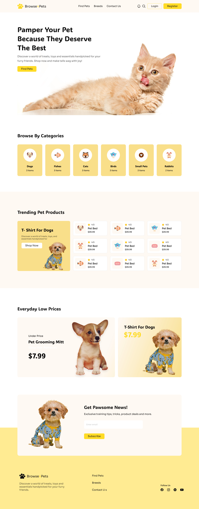

### IN THE NAME OF ALLAH, THE MOST GRACIOUS, THE MOST MERCIFUL

# Browse For Pets

Welcome to **Browse For Pets**, a beautifully designed and fully responsive landing page for pet lovers and pet accessories. This project aims to provide an engaging and user-friendly experience for visitors looking for pet products and services. It also highlights current offers, frequently asked questions, contact information etc.

#### [Click here](https://sajjad1007.github.io/Browse-For-Pets/) to visit the website.

## Technologies Used

1. **HTML5:** A markup language for structuring the website with clean and semantic coding.
2. **Tailwind CSS:** An utility-first CSS framework for fast and responsive styling.
3. **DaisyUI:** A Tailwind-based component library for pre-styled UI elements.

## How To Use

1. Clone the repository by typing this command in the terminal:
   ```bash
   git clone https://github.com/Sajjad1007/Browse-For-Pets.git
   ```
2. Open the project folder and launch `index.html` in your browser.

## Desktop View

 
